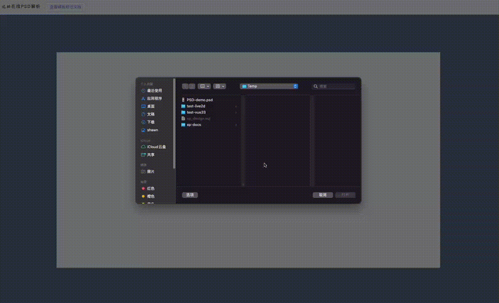

点此下载测试psd模板：**PSD-demo.psd**（[下载地址1](/PSD-demo.psd)、[下载地址2](https://fastly.jsdelivr.net/gh/palxiao/xp-docs@main/docs/PSD-demo.psd)）

-> [直接访问亲自体验](https://design.palxp.com/psd)

1. 点击 “我的” - “资源管理”，上传PSD模板按钮，进入上传界面。

2. 选择或拖入 PSD 文件，等待解析完成后开始编辑，调整好模板后点击右上角“上传模板”，等待完成。

> 注：页面资源将上传到 **Github** 保存，请确认您的网络环境可以访问 Github，否则上传会失败。

3. 上传完成后点击查看作品即可打开模板，此后在 “我的” - “我的作品” 中可以找到该模板。

> 由于墙的原因，**下载图片**可能会图裂，因为服务器无法正常访问资源，这不是BUG。

#### 上传 PSD 模板规范

[🔗 跳转至文档链接](https://www.kdocs.cn/l/clmBsIkhve8d)

<iframe height=650 width=100% src="https://www.kdocs.cn/l/clmBsIkhve8d" frameborder=0 allowfullscreen />