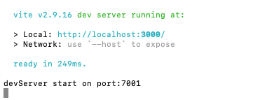

> 环境需求：**Node.js v16** 以上版本

### 拉取源码

```
git clone https://github.com/palxiao/poster-design.git
cd poster-design
```

### 安装依赖

```
npm run prepared
```

### 本地运行

```
npm run serve
```

> 将会同时运行前端界面与图片生成服务：
> 
> 

### 运行结果


合成图片时本地会启动一个Chrome浏览器实例。

### 打包前端页面

```
npm run v-build
```

### 打包图片生成服务

```
cd sreenshot
npm run build
```

### 服务端

可参考接口API文档自行实现服务端。
