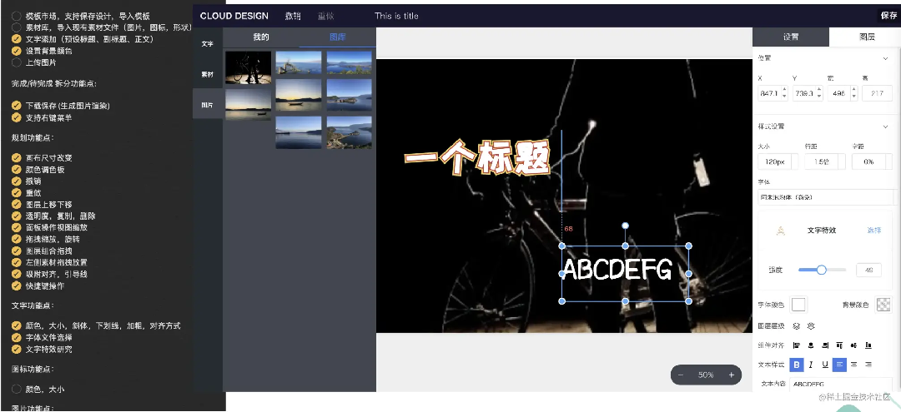

该项目最早是我在公司中独立负责开发的一个图片海报编辑器项目，它的定位是一个 ToB 的媒体采编附属产品，主要用于快速生产标准化的新闻事件传播图。

而领导的要求是要我**对标稿定设计**，在此之前我虽然也体验过一些在线海报编辑器，但还并不知道稿定，所以并没有放在心上。

当时我在公司做的也都是些零散的项目需求，觉得没意思又耗时间，相比之下这个项目有意思多了，所以在**没有产品、没有UI、研发只有1人**的情况下，我还是拼命挤出时间来开发这个项目。

而随着功能的完善，项目细节的不断深入，我逐渐明白开发编辑器并非一件易事，不仅需要良好的coding基础，对某些专业知识也要求极高，有许多问题直至今天我都无法彻底解决，而稿定在许多方面也确实做到了业界较高的水平。

>当时公司整体都是 Vue2 技术栈的，还没有任何一个 Vue3 项目，于是一开始出于惯性我也用 Vue2 搭建项目，后来感觉这个项目和后台系统耦合不大，于是又用最新的 Vite2 + Vue3 技术重构了。
>
>
> 粗糙的第一版勉强开发完时，还并未确定图片生成的方案。

再后来，从前端 **html2canvas** 方案再到服务端 **puppeteer** 出图方案，