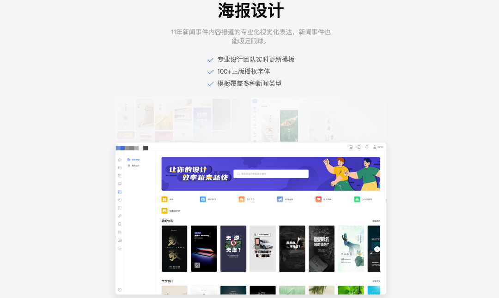

### 项目起源

我在之前的公司中独立负责过一个**海报图片编辑器**的开发，它的定位是一个 ToB 的媒体采编附属产品，主要应用于快速生产标准化新闻事件类传播图。

在此之前我也体验过一些在线海报编辑器，而领导的要求是要**对标稿定设计**，于是我便开始了对稿定的深度体验，慢慢地发现稿定在许多方面确实做到了业界较高的水平。

当时我在公司做的都是些普通零散的项目需求，觉得没意思又耗时间，相比之下这个项目则更有挑战性，所以即使在**没有产品、没有UI、研发只有我1人**的情况下，还是挤出时间独自研发。

而随着功能的完善，项目细节的不断深入，开发难度超过了我最初预期，想要实现功能丰富的编辑器并不容易，不仅需要良好的coding基础，越是深入也越需要更多专业知识(如数学与图形学等)，有许多细节问题直至今天都在困扰着我，以我个人浅薄的技术能力一时间总是无法完美解决。

>当时公司整体都是 Vue2 技术栈的，还没有任何一个 Vue3 项目，于是一开始出于惯性我也用 Vue2 搭建项目，后来感觉这个项目和后台系统耦合不大，于是又用 Vite2 + Vue3 技术栈重构了。

后来，从前端 **html2canvas** 插件到服务端 **puppeteer** 出图方案，从手写拖拽缩放功能到采用成熟的 **moveable** 第三方库代理操作，从手动拉建模板到 **PSD 解析**模板，整个项目在三个月左右的时间里算是大致成型。

不过，项目在公司内的进展并不顺利，一方面产品无法把握项目的规划，提出的需求不切实际；另一方面UI介入后我又要花费时间在界面修改上，改了一版又一版，而更多的细节和体验问题也不断暴露出来，令我应接不暇。

于是我开始将项目代码独立了出来，在自己的服务器上部署了我最初仿造稿定设计的一版，自己规划接下来要做的功能、优化与迭代，也是在那时，我在掘金社区发布了一篇总结类的文章，讲述了这段研发历程，得到了不少关注和鼓励，这也让我坚定了将项目开源出来的想法。

-----
  
如果你也对图片编辑器感兴趣，欢迎一起共建项目！

或许你在工作中有类似的需求，希望这个项目能给到你一些微薄帮助！

目前本项目也还在持续迭代中，有很多的不足，我也是一边学习一边成长。开源不易，希望看到这里的你可以给本项目点个 **Star** 支持一下~

**Github 仓库地址: [ palxiao/poster-design ](https://github.com/palxiao/poster-design)**

-----

### 迭代计划

#### Feature:

- [x] P1: 文字特效属性编辑面板开发
- [x] P1: ~~字体选择记录在顶部~~ 增加了页面字体Tab
- [x] P1：字体抽取 | 增加了谷歌字体，使用国内CDN链接
- [ ] PSD 解析重构（暂缓，涉及基础库更换）
- [ ] 支持多画板与多图下载
- [ ] 图片容器支持在属性面板中选择使用
- [x] PSD 模板支持上传（目前把Github当作图床测试，仅支持本地下载）
- [x] 增加在线抠图
- [x] 抠图优化：支持在属性面板内使用，并将结果直接作用于画布
- [x] 抠图优化：增加手动精细操作
- [x] Todo: 恢复前端出图，使用在保存封面中（放弃）
- [ ] 未修改的作品不重复截图（Bug: history存在问题）
- [x] Todo: 图片懒加载改为element自带
- [ ] 增加快捷键提示板
- [ ] Todo: 将 transform 语法糖转为 matrix
- [x] 完善图库，从unsplash抓取图片，自动翻译描述
- [ ] 背景图可操作调整偏移
- [ ] 画布设置支持预设分辨率快速调整
- [ ] 画布修改分辨率后自动调整元素缩放
- [ ] 组合重组、组合内解锁移动
- [ ] 鼠标圈选多个同时缩放
- [ ] 旋转角度数字显示
- [x] 颜色选择器支持渐变色修改
- [x] 支持形状绘制（不实现，使用svg素材）
- [ ] 滚轮缩放优化：以鼠标为中心点
- [ ] 背景支持设置渐变色，PageStyle逻辑需要修改（低优先级）
- [ ] TODO: 增加帮助按钮，提示快捷键操作
- [ ] 支持空格拖拽画布
- [ ] 增加剪切以及快捷键支持
- [ ] 图片裁剪优化

#### Bugs:

- [ ] 组合与旋转缩放bug
- [ ] 组合会导致旋转丢失
- [ ] 文字拖动缩小极限值有问题
- [x] 画布滚动条问题、放大后标尺不完整
- [x] 瀑布流的实现排列有点问题
- [x] 书架流图片排版逻辑重构
- [x] P1: 复制粘贴元素时会把剪切板内容带入
- [x] 添加对数字负值输入的支持
- [x] 形状(贴图)放开调整宽高拖动
- [x] 文字末尾折行（文字抽取时漏空格导致
- [x] 单独绘制svg会出现不显示的情况
- [x] P0: 文字超出画布往上顶
- [x] ~~优化draw页面加载的文件（放弃~~
- [x] 实现透明像素穿透（目前体验还较差
- [x] 颜色选择器
- [ ] 背景图无法检测是否加载完毕，考虑应该将设置背景作为独立事件
- [ ] 图片替换后分辨率适配
- [x] 每点击元素一次属性面板就会闪烁一次（因清空再赋值而触发
- [ ] 裁剪后文字等比缩放出问题
- [ ] 首次加载模板后不能直接拖动元素
- [ ] P1: 文字输入多空格退出编辑后会消失
- [ ] 复制粘贴组合有问题
- [ ] 键盘移位需要防抖入栈
- [ ] 大多数字体操作项未入栈

#### Ideas:

- [ ] Gif 生成研究（方案1：视频录制
- [ ] 文字路径变形研究
- [ ] ~~Electron 客户端套壳~~
- [ ] 批量替换出图功能（需要先完成多画板