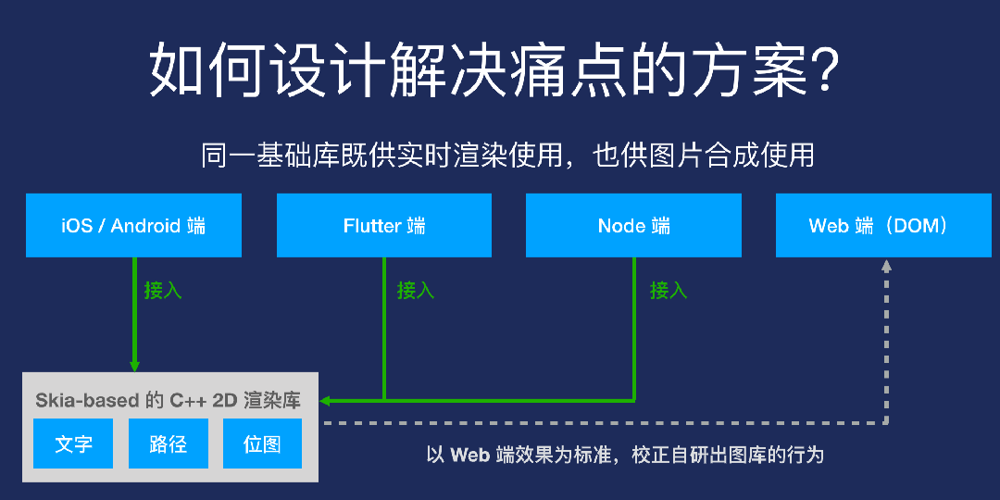
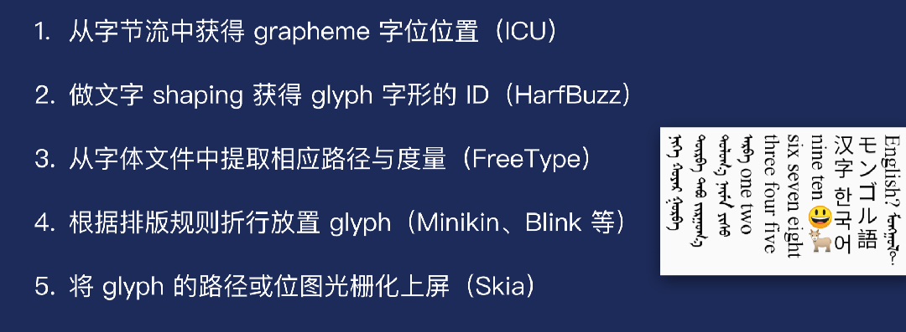
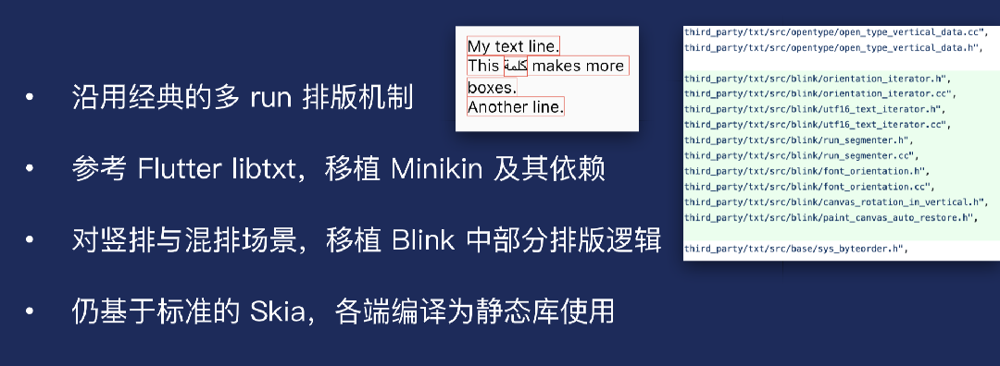
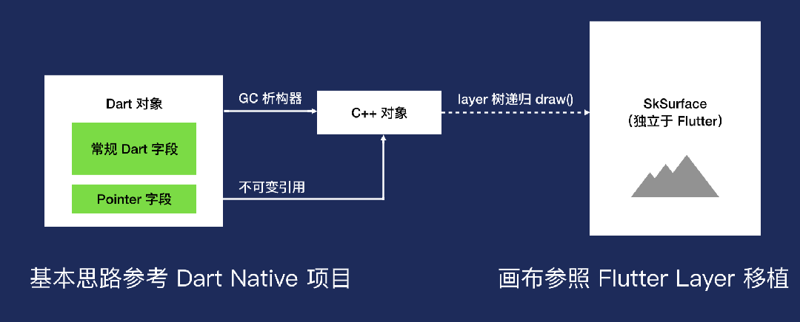
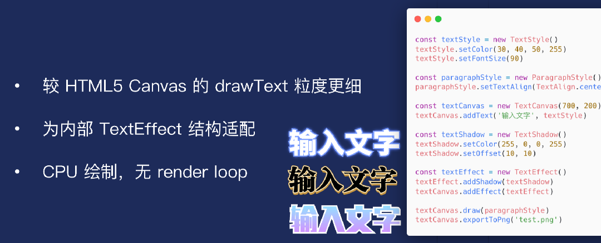

### 出图方案速览：

- 稿定业务最早使⽤ Puppeteer 出图，其作为兜底微服务沿⽤⾄今 
- 前端 2D 内容绘制：位图、⽮量、⽂字，前两者均易于绘制，难在⽂字，业务使⽤过基于 Canvas 的⽂字出图，后改⽤ SVG `<foreignObject> `
- 目前稿定设计超过 90% 下载请求使⽤前端出图

### 曾面临的问题及痛点：

- ⼀致性问题：各端存在折⾏、描边、阴影、竖排等效果差异
- 开发效率问题：需各端重复实现出图绘制逻辑，还要互相对⻬效果 
- 运⾏效率问题：Puppeteer ⻚⾯的启动开销⼤，不利于⻓图合成

### 基于 Skia 的 C++ ⽂字出图库实现

### 稿定设计自研方案搭建

### 跨平台出图库的 Flutter 端接⼊

- Skia 画布内容整体绘制到 TextureWidget，实现流畅同步
- 编辑器业务层⽆需混编，与外围控件共享同个 Dart VM Isolate 
- 仍使⽤标准的 Flutter 框架（2.0 版本 FFI 已稳定）

### 跨平台出图库的 Node 端接⼊

参考：《稿定多端出图⽅案的演化》——王译锋（雪碧）