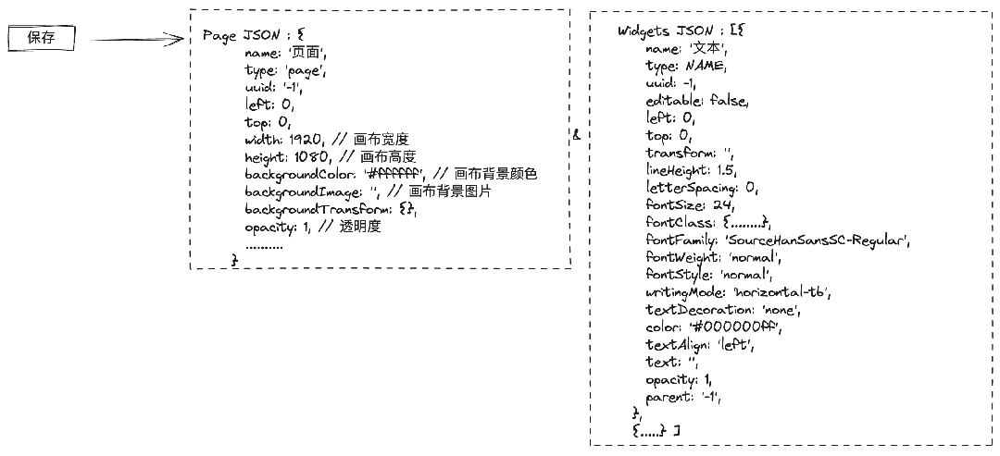
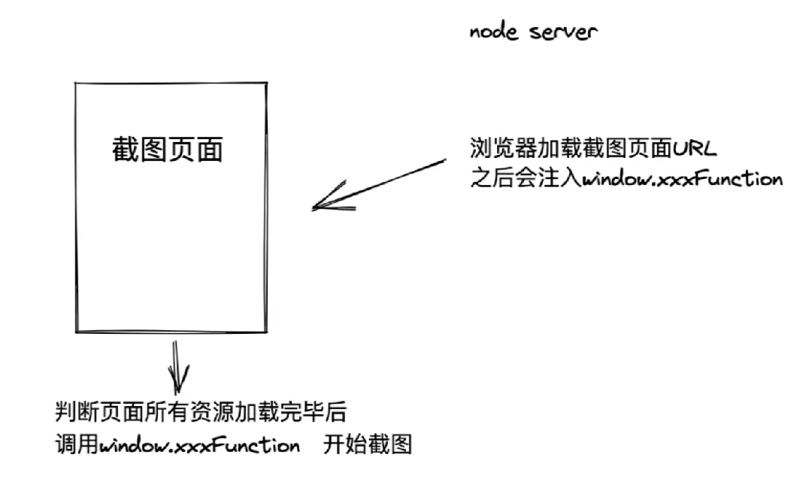

编辑界面就不多说了，就是对着稿定设计来，主要说说在保存时的操作，实际保存的是两段JSON内容：



其中 Page 是整个页面的 Schema，而 Widgets 则是扁平化的数组，代表着整个页面中的元素集合，扁平化是为了方便更直观地实现层级，实际代码中会转译成树形结构才能生成嵌套的组件。

保存这些 JSON 后，在绘制页面请求这些信息，然后将页面呈现出来，绘制页移除了画布操作、属性菜单面板等编辑页才有的功能，只保留了基础组件的引入（如果有充足开发成本可尝试采用 SSR 进一步提升速度），并通过一系列方法判断字体、图片、SVG等元素是否加载完毕，一旦整个页面以及资源都加载完毕则调用 window 下的通知方法开始截图。

在服务端，我们使用 puppeteer 启动无头浏览器，利用 Chrome 打开绘制页，并往其 window 注入通知方法，以此完成整个图片生成操作的闭环。



### 技术栈概括

前端：Vue3 、Vite2 、Vuex 、ElementPlus

图片生成：Puppeteer、Express

服务端：Node.js

一些可独立的功能会被抽取出来作为单独的库引入使用，具体请查看该文档：[front-end-arsenal](https://fe-doc.palxp.com/#/)

仓库源码地址：https://github.com/palxiao/front-end-arsenal

### 前端目录详解

`/sudo-design/src`

```json
├── App.vue
├── api // 请求接口管理
├── assets
|  ├── data // 数据资源
|  ├── fonts // 本地字体资源
|  └── styles // CSS 样式文件
├── common // 存放一些公共方法，例如上传下载、弹窗提示等
|  ├── hooks
|  └── methods
├── components
|  ├── business // 放置业务组件
|  |  ├── cropper // 裁剪（暂时弃用）
|  |  ├── image-cutout // 抠图
|  |  ├── moveable // 操作插件
|  |  ├── picture-selector // 照片库弹窗选择
|  |  ├── qrcode // 二维码插件
|  |  ├── right-click-menu // 右键菜单
|  |  └── save-download // 保存下载弹窗
|  ├── common // 公共组件
|  |  ├── PopoverTip.vue // 气泡提示组件
|  |  ├── ProgressLoading // 百分比进度条
|  |  └── Uploader // 上传组件
|  └── modules // 核心模块
|     ├── index.ts
|     ├── layout
|     |  ├── designBoard.vue // 主界面
|     |  ├── lineGuides.vue // 网格（弃用，由moveable提供辅助线功能）
|     |  ├── sizeControl.vue // 元素操作组件（弃用，由moveable代理）
|     |  └── zoomControl.vue // 缩放画布
|     ├── panel // 该目录下的所有文件自动导入项目中
|     |  ├── components
|     |  ├── stylePanel.vue // 右侧属性编辑面板
|     |  ├── widgetPanel.vue // 左侧功能菜单面板
|     |  └── wrap
|     |     ├── BgImgListWrap.vue // 背景选择面板
|     |     ├── PhotoListWrap.vue // 照片面板
|     |     ├── TempListWrap.vue // 模板列表
|     |     ├── ToolsListWrap.vue // 工具面板
|     |     ├── UserWrap.vue // 我的资源作品面板
|     |     ├── GraphListWrap.vue // 素材面板
|     |     ├── CompListWrap.vue // 组合列表（目前主要是文字组合）
|     |     └── TextListWrap.vue // 文字面板
|     ├── settings // 放置操作面板下的一些组件
|     |  ├── EffectSelect // 效果选择（未开发）
|     |  ├── colorSelect.vue // 颜色选择
|     |  ├── iconItemSelect.vue // icon选择
|     |  ├── numberInput.vue // 数字输入
|     |  ├── numberSlider.vue // 数字拖拉
|     |  ├── textInput.vue // 文字输入
|     |  ├── textInputArea.vue // 文字域输入
|     |  └── valueSelect.vue // 下拉选择
|     └── widgets // 该目录下的所有文件自动导入项目中
|        ├── pageStyle.vue // 背景/页面设置
|        ├── wGroup // 组合
|        |  ├── wGroup.vue
|        |  └── wGroupStyle.vue // 对应右侧面板的操作
|        ├── wImage // 图片
|        |  ├── components
|        |  |  └── innerToolBar.vue
|        |  ├── wImage.vue
|        |  └── wImageStyle.vue // 对应右侧面板的操作
|        ├── wQrcode // 二维码
|        |  ├── wQrcode.vue
|        |  └── wQrcodeStyle.vue // 对应右侧面板的操作
|        ├── wSvg // 矢量图
|        |  ├── wSvg.vue
|        |  └── wSvgStyle.vue // 对应右侧面板的操作
|        └── wText // 文字
|           ├── wText.vue
|           └── wTextStyle.vue // 对应右侧面板的操作
├── config.ts // 公共配置
├── main.ts // 项目入口文件
├── mixins // 一些公共混合代码，待优化
|  ├── methods
|  |  ├── DealWithCtrl.ts
|  |  └── keyCodeOptions.ts
|  ├── mouseDragging.ts
|  ├── move.ts
|  └── shortcuts.ts
├── router // vue 路由
|  ├── Base.ts
|  ├── hook.ts
|  └── index.ts
├── store // Vuex 状态管理器
|  ├── index.ts
|  └── modules
|     ├── base
|     |  ├── actions.ts
|     |  ├── index.ts
|     |  └── mutations.ts
|     └── design
|        ├── actions.ts
|        ├── index.ts
|        └── mutations.ts
├── types // TS类型配置
|  ├── env.d.ts
|  ├── properties.d.ts
|  ├── shims-vue.d.ts
|  ├── vue-ts.d.ts
|  └── vuex-shim.d.ts
├── utils // 工具函数目录
|  ├── axios.ts
|  ├── http-request.ts
|  ├── index.ts
|  ├── plugins
|  |  ├── cssLoader.ts // 异步加载css
|  |  ├── modules.ts // 全局加载公共组件
|  |  ├── pointImg.ts // 图片点位颜色，测试中
|  |  ├── preload.ts // 加载资源
|  |  └── psd // 设计稿解析
|  ├── utils.ts
|  └── widgets
|     └── elementConfig.ts // 配置全局默认导入的element组件
└── views // 页面目录
   ├── Draw.vue // 绘制页
   ├── Index.vue // 编辑页（首页）
   ├── Psd.vue // PSD解析页
   ├── Ready.vue // 初始化
   └── components
```

目录数量: 58；文件数量: 144

项目开发至一半时才改用 Vue3 重构，所以有部分代码混合了 Options 写法。
