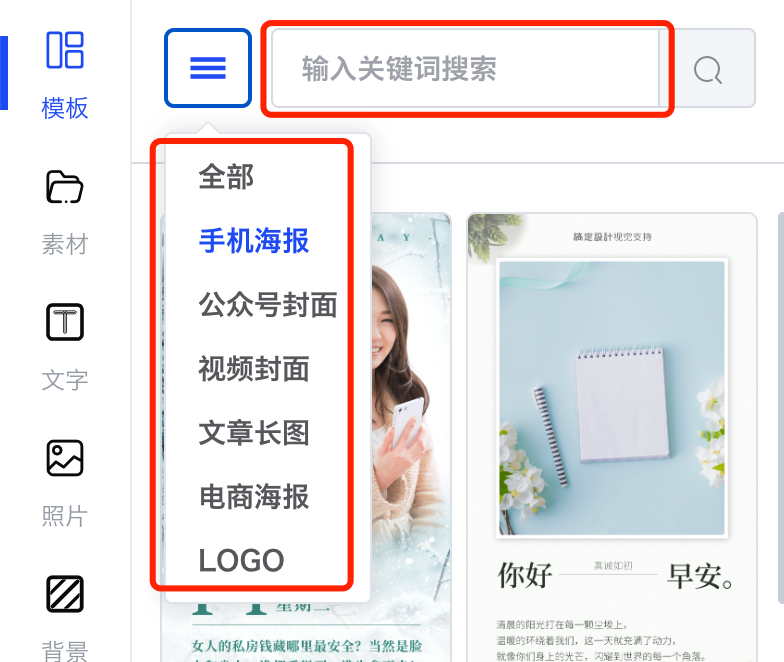
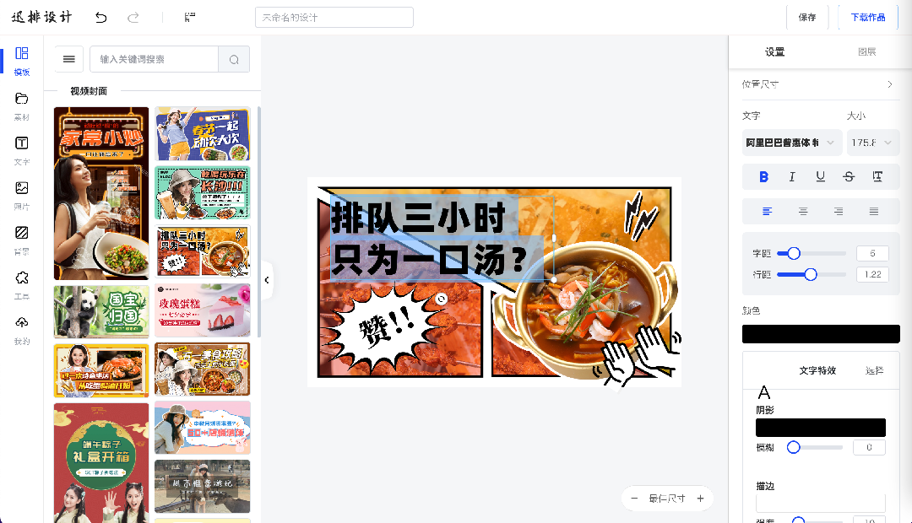
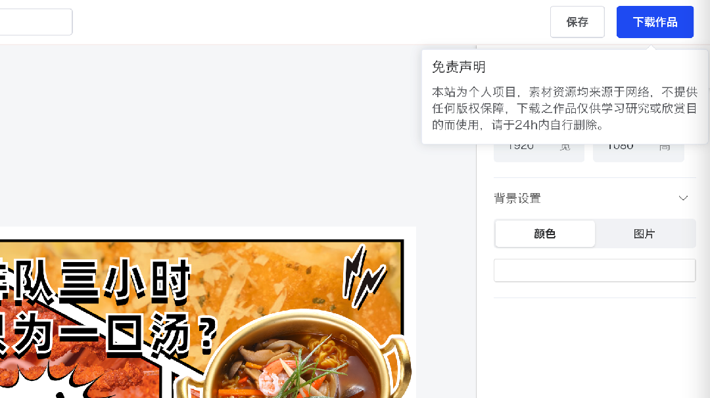
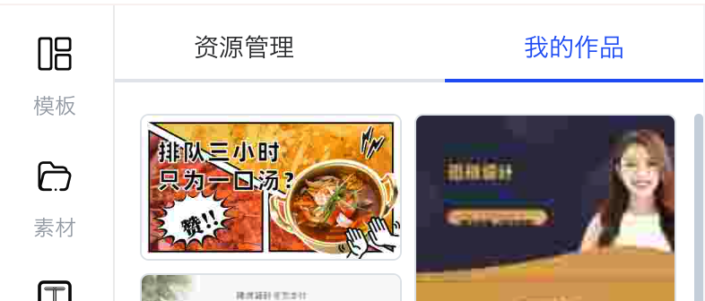
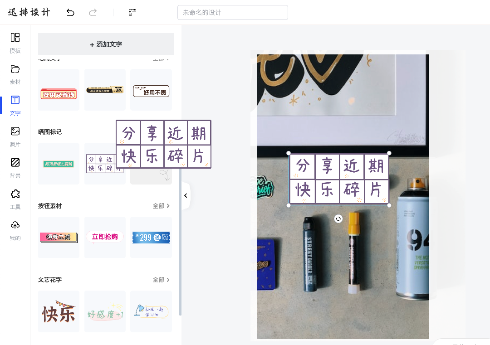

### 查找或搜索模板

- 确认作图需求 -> 开始内容创作

- 双击替换文字或自行添加

- 点击右上角下载作品

- 可在“我的作品”中重复创作或下载

------

### 从空白画布开始创作

- 访问[迅排设计首页](https://design.palxp.com/home)，默认空白画布。

- 修改画布至所需要的尺寸

- 通过**我的** - **资源管理**上传图片，或在照片库中挑选图片

- 添加素材、文字、组合或图片进行自由创作

------

### 上传自有模板开始创作

[PSD在线解析模板上传 ->](/articles/1687855172725)
