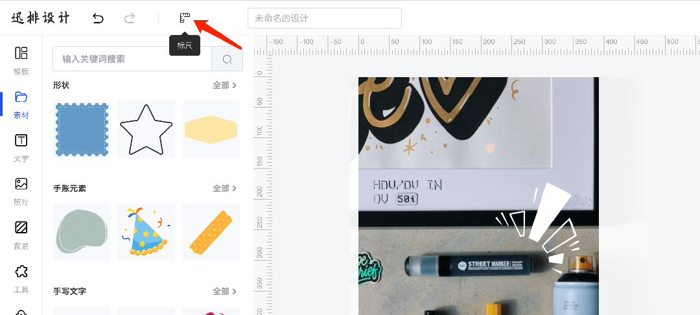
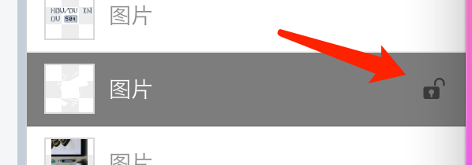
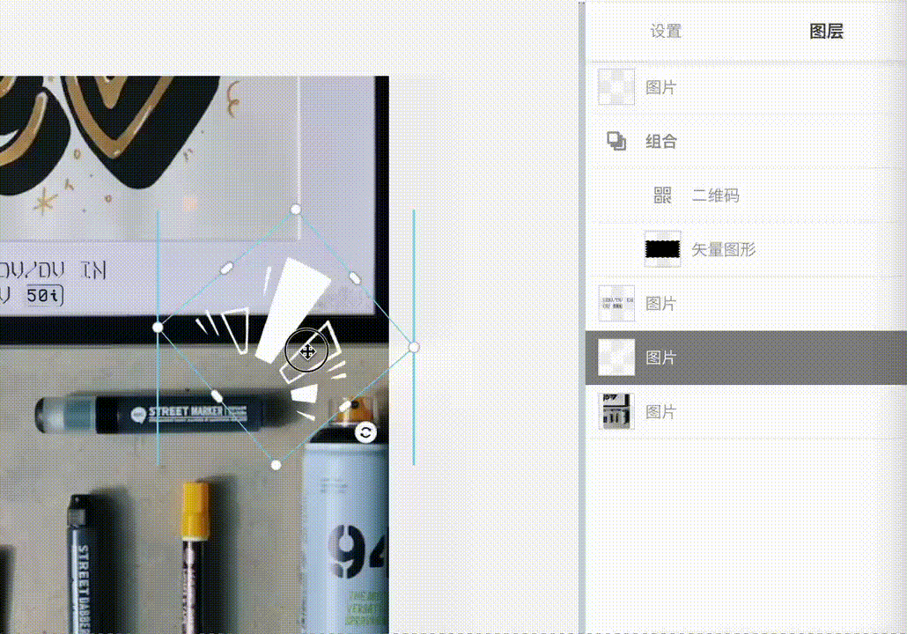
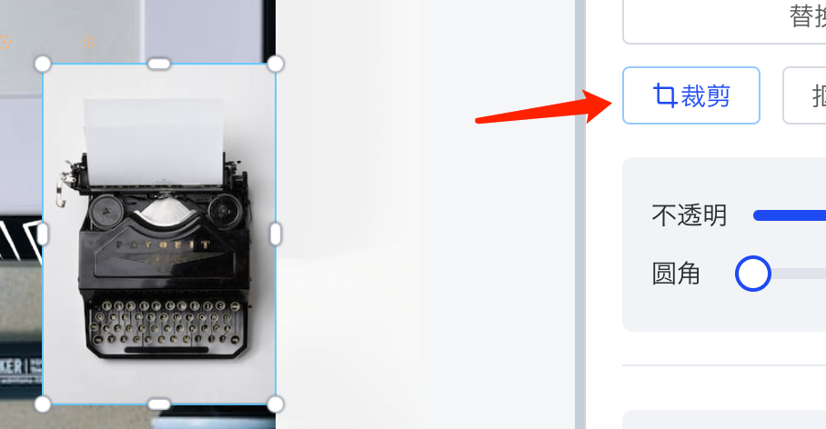
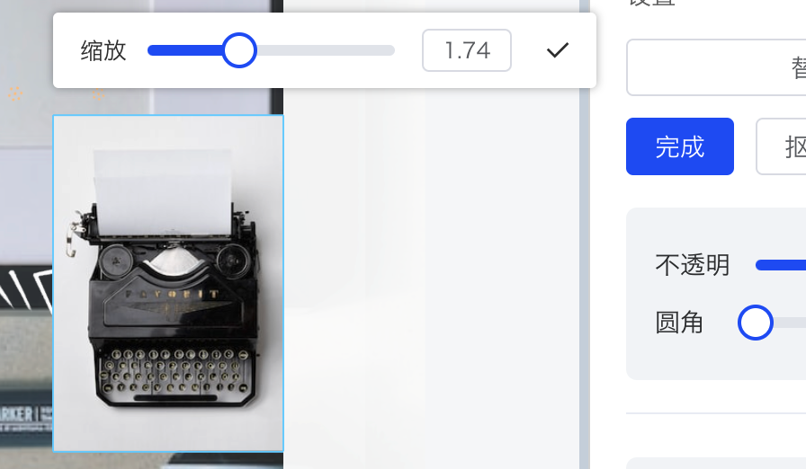
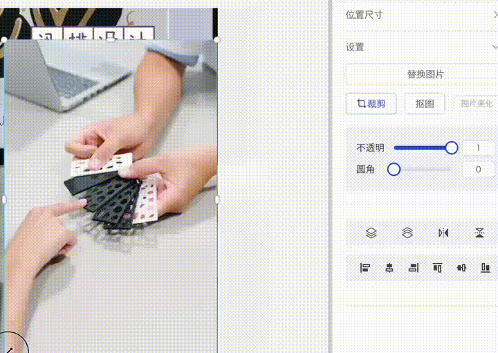
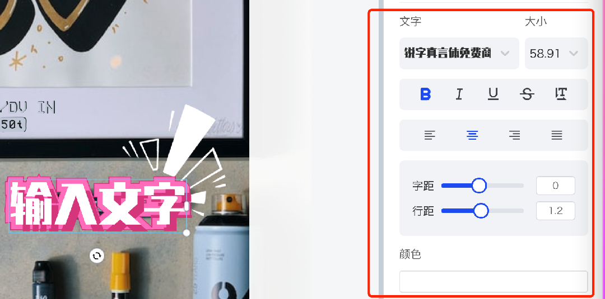
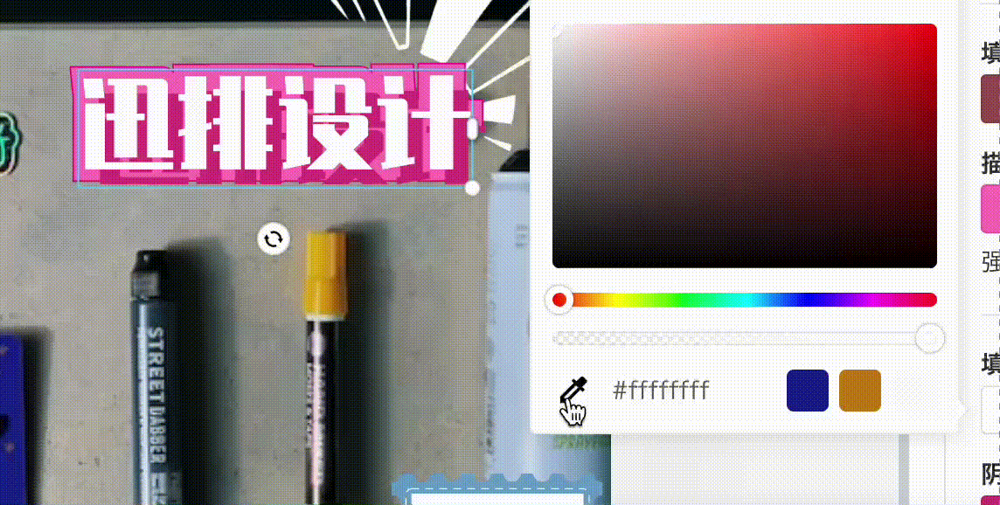

## 编辑器常用操作

### 快捷键

- **保存**：Ctrl / Command + **S**
- **复制（选中元素）**：Ctrl / Command + **C**
- **粘贴**：Ctrl / Command + **V**
- **多选**：按住 Shift 或 Ctrl / Command 然后**鼠标点选**
- **组合成组（多选时）**：Ctrl / Command + **G**

### 参考线

- 点击状态栏中的“标尺”按钮创建画布上的**标尺**

- 从标尺中**拖出**辅助线，拖回标尺中**删除**辅助线

### 图层锁定解锁

- 右侧属性面板先切换到“**图层**”面板，选中目标元素时对应图层会高亮：

- 鼠标覆盖上图层，点击其右侧的锁定按钮即可锁定图层

- 图层锁定后将**固定**在画布中，此时元素变得**不可移动**。

- 再次点击按钮即可解锁

## 图片

### 缩放和裁剪

- 点击图片，选中四角点拖拽等比缩放大小

| 选择右侧“裁剪” | 可对图像内容进行缩放裁剪 |
| --- | --- |
|  |  |

裁剪通常用于只显示原图像的一部分：

## 文字

- 粗体：对文本加粗，起到强调作用
- 斜体：倾斜字体实现的一种字体样式
- 下划线：输入文本时，文本下方会自动出现横线
- 删除线：在文本的中间部分出现横线，起到删除的提示

**特效文字**

- 选择“文字”，拖入文字到画布中，点击右下角缩放大小，或修改**右侧属性面板**的大小

- **双击**文字内容，编辑文字

- 修改颜色

（目前文字特效模块还在开发阶段）