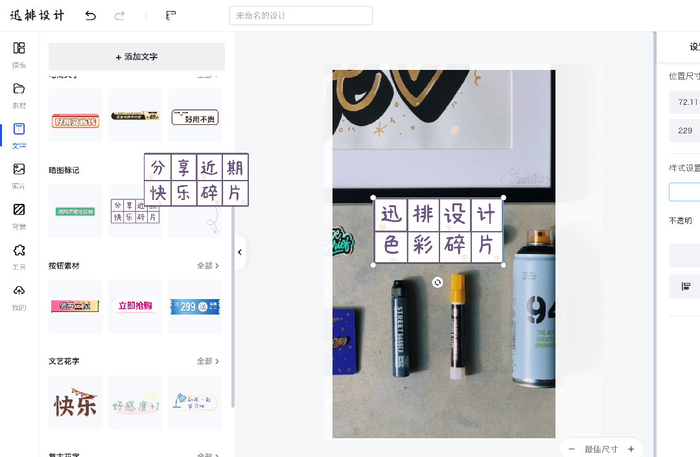
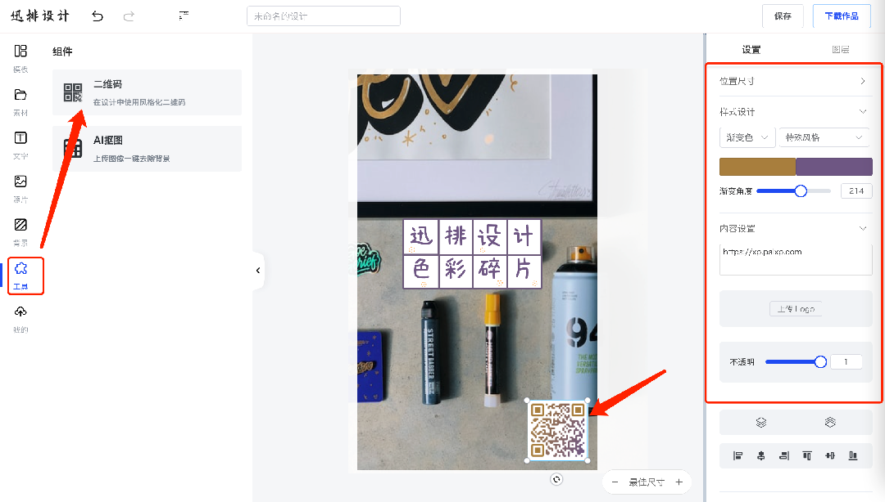
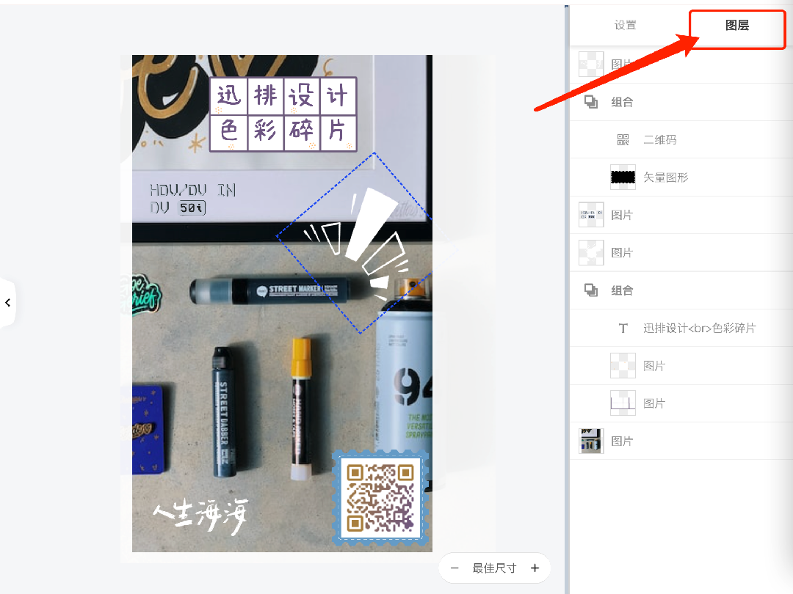
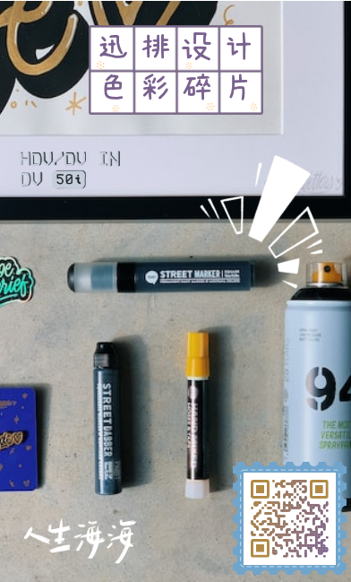
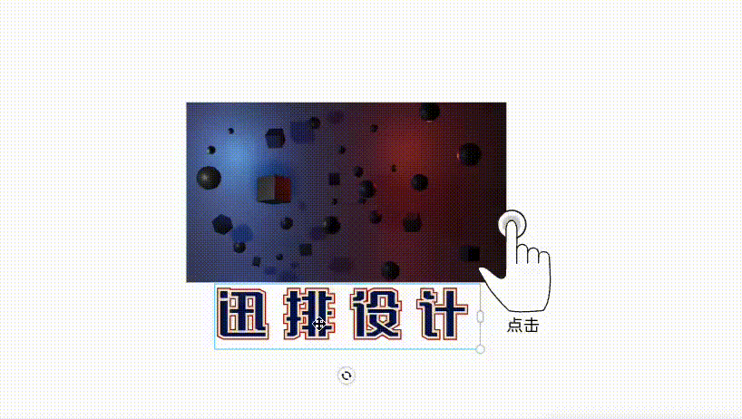
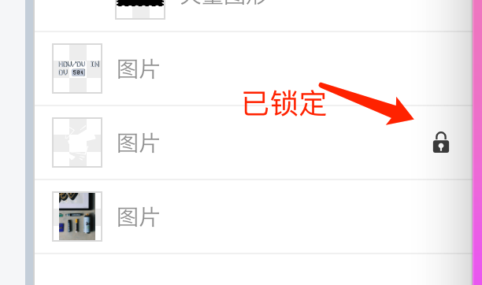
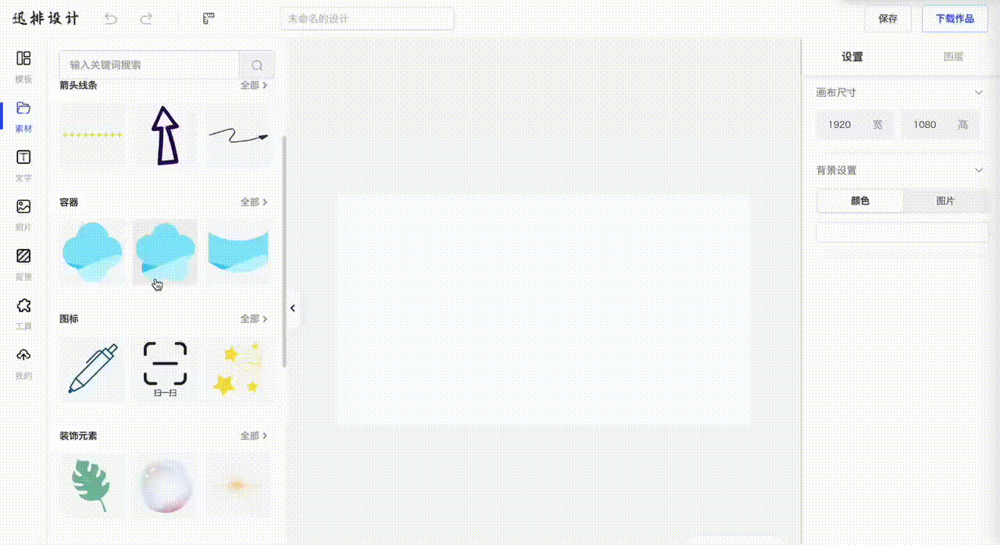

前方多图请耐心等待..

## 开始你的作品

#### 1. 确认作图需求 -> 开始内容创作

#### 2. 双击替换文字或自行添加

#### 3. 点击右上角下载作品

#### 4. 可在“我的作品”中重复创作或下载

------

### 从空白画布开始创作

#### 1. 访问[迅排设计首页](https://design.palxp.com/home)，默认空白画布，修改至所需尺寸

#### 2. 通过**我的** - **资源管理**上传图片，或在照片库中挑选图片：

#### 3. 添加**素材**、**文字**、**组合或图片**进行自由创作：

#### 4. 添加二维码，编辑内容，拖拽其大小位置：

#### 5. 点击**图层**查看/快速调整元素**层级：**

#### 6. 编辑完成后点击**右上角下载**成品图片

- 完成图片可在“**我的作品**”中重复创作或下载

------

> **上传自有模板开始创作：**
> 
> [PSD在线解析模板上传 ->](/articles/1687855172725)

------

## 编辑与设计

### 编辑器常用操作

#### 1. 快捷键

- **保存**：Ctrl / Command + **S**
- **复制（选中元素）**：Ctrl / Command + **C**
- **粘贴**：Ctrl / Command + **V**
- **多选**：按住 Shift 或 Ctrl / Command 然后**鼠标点选**
- **组合成组（多选时）**：Ctrl / Command + **G**

#### 2. 参考线

##### 点击状态栏中的“标尺”按钮创建画布上的**标尺**

##### 从标尺中**拖出**辅助线，拖回标尺中**删除**辅助线

#### 3. 图层锁定解锁

- 右侧属性面板先切换到“**图层**”面板，选中目标元素时对应图层会高亮：

- 鼠标覆盖上图层，点击其右侧的锁定按钮即可锁定图层

##### 图层锁定后将**固定**在画布中，此时元素变得**不可移动**。

##### 再次点击按钮即可解锁

### 图片

#### 1. 缩放和裁剪

##### 点击图片，选中四角点拖拽等比缩放大小

| 选择右侧“裁剪” | 可对图像内容进行缩放裁剪 |
| --- | --- |
|  |  |

##### 裁剪通常用于只显示原图像的一部分：

#### 2. 容器

##### 拖动图片放置到裁剪区域中

### 文字

- 粗体：对文本加粗，起到强调作用
- 斜体：倾斜字体实现的一种字体样式
- 下划线：输入文本时，文本下方会自动出现横线
- 删除线：在文本的中间部分出现横线，起到删除的提示

**特效文字：**

##### 选择“文字”，拖入文字到画布中，点击右下角缩放大小，或修改**右侧属性面板**的大小

##### **双击**文字内容，编辑文字

##### 修改颜色

（目前文字特效模块还在开发阶段）

------

## 上传 PSD 模板

点此下载测试 psd 模板：**PSD-demo.psd**（[下载地址1](https://xp.palxp.com/PSD-demo.psd)、[下载地址2](https://fastly.jsdelivr.net/gh/palxiao/xp-docs@main/docs/PSD-demo.psd)）

#### 1. 点击 “我的” - “资源管理”，上传PSD模板按钮，进入 [PSD解析上传界面](https://design.palxp.com/psd)。

#### 2. 选择或拖入 PSD 文件，等待解析完成后开始编辑，调整好模板后点击右上角“上传模板”，等待完成。

#### 3. 上传完成后点击查看作品即可打开模板，此后在 “我的” - “我的作品” 中可以找到该模板。

> 在线 Demo 仅供测试，图片临时保存到 **Github**，模板上传完成后立即查看作品或下载图片可能会图裂，这是因为资源还无法立即被访问到，需要等待一会刷新查看。如果一直不能正常显示，可能你的网络环境不佳，必要时需科学上网。

#### 上传 PSD 模板规范：

[🔗 查看在线文档 -> ](https://www.kdocs.cn/l/clmBsIkhve8d)

------

## 体验 AI 抠图

#### 1. 左侧主菜单选择“工具” - “AI抠图”（[快捷访问](https://design.palxp.com/home?koutu=1)）。

#### 2. 上传你需要去除背景的图片，图片尽量是主体前景与背景有较明显差异的。

#### 3. 等待一会后下载图片使用

